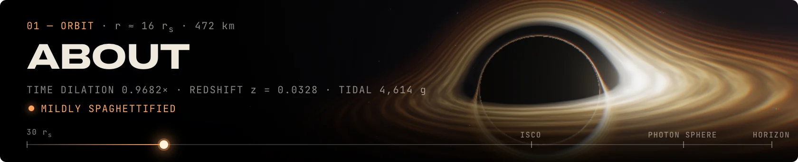
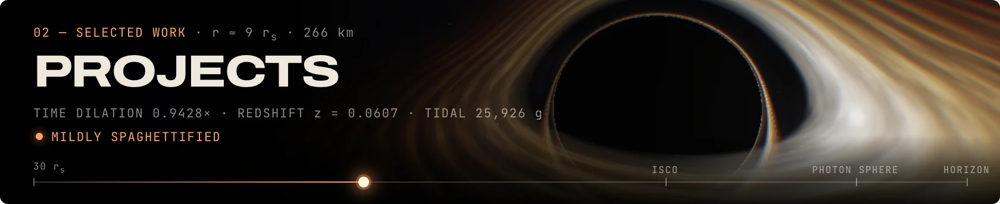
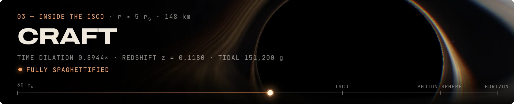
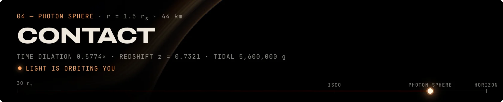
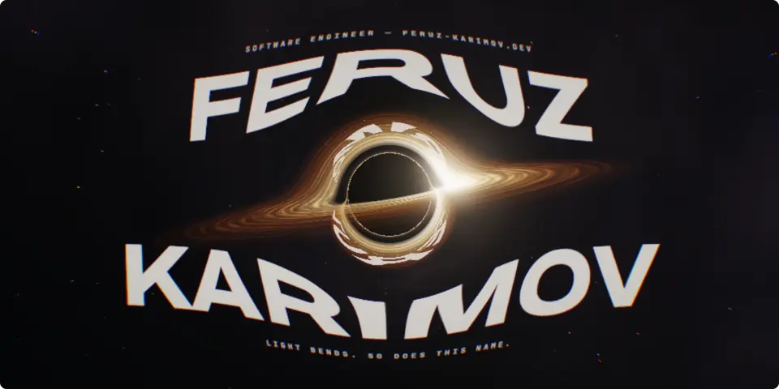
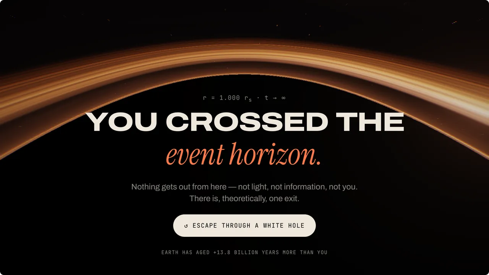

  CS + Data Science at Rutgers. Co-founder of <a href="https://jonivor.com.uz">Jonivor</a>. Building things with <i>unreasonable</i> gravity.

  <samp>FK-1 · SCHWARZSCHILD · 10 M☉</samp> — every pixel above is a light ray integrated through the Schwarzschild metric. 
  <a href="https://feruz-karimov.dev">Fall into the live one ↗</a> &nbsp;·&nbsp; or scroll to fall in ↓

 

I ship things people actually use — a pet-care marketplace with ***1,000+ accounts***, an export that went from crashing at 50k rows to streaming ***200k in 12 seconds***, and open benchmarks that ***show their work***.

<table>
  <tr><td><samp>CURRENTLY</samp></td><td>Co-founder & Engineer @ <a href="https://jonivor.com.uz">Jonivor</a></td></tr>
  <tr><td><samp>STUDYING</samp></td><td>CS + Data Science, Rutgers ’28</td></tr>
  <tr><td><samp>PREVIOUSLY</samp></td><td>SDE Intern @ EPAM Systems</td></tr>
  <tr><td><samp>BASED IN</samp></td><td>SF / NJ</td></tr>
</table>

 

<table>
  <tr>
    <td><samp>01</samp>&nbsp; <a href="https://jonivor.com.uz"><b>Jonivor</b></a>&nbsp;↗</td>
    <td>Pet-care marketplace — built solo in 10 weeks, <i>1,000+ accounts</i> Next.js · SwiftUI · Telegram Mini App · Postgres · 2026</td>
  </tr>
  <tr>
    <td><samp>02</samp>&nbsp; <a href="https://vannaris.com"><b>Vannaris</b></a>&nbsp;↗</td>
    <td>Independent benchmark of web-search APIs for AI agents Python · 3-lab LLM judges · Bootstrap CIs · 2026 · <a href="https://github.com/feruzkarimovv/vannaris">source</a></td>
  </tr>
  <tr>
    <td><samp>03</samp>&nbsp; <a href="https://github.com/feruzkarimovv/gha-graph"><b>gha-graph</b></a>&nbsp;↗</td>
    <td>See and lint GitHub Actions workflows before you push TypeScript · npm CLI · SARIF · 2026</td>
  </tr>
  <tr>
    <td><samp>04</samp>&nbsp; <a href="https://vibeduel-peach.vercel.app"><b>VibeDuel</b></a>&nbsp;↗</td>
    <td>Multiplayer arena: race to build an app with Claude, AI judge, ELO Next.js · Supabase Realtime · Claude · 2026 · <a href="https://github.com/feruzkarimovv/vibeduel">source</a></td>
  </tr>
  <tr>
    <td><samp>05</samp>&nbsp; <b>RepoLens</b></td>
    <td>Change-impact analysis — what a PR might break, to the <i>exact line</i> FastAPI · pgvector · Hybrid retrieval</td>
  </tr>
  <tr>
    <td><samp>06</samp>&nbsp; <a href="https://github.com/feruzkarimovv/vibecheck"><b>VibeCheck</b></a>&nbsp;↗</td>
    <td>Security scanner for the bugs AI coding tools introduce TypeScript · AST · CLI · 2026</td>
  </tr>
</table>

 

Past 3 rs no orbit is stable. *That’s where the interesting work is.*

<table>
  <tr><th align="left"><samp>CAPABILITIES</samp></th><th align="left"><samp>TRAJECTORY</samp></th></tr>
  <tr>
    <td valign="top">
      Full-stack product engineering 
      Backend systems (Spring Boot, FastAPI) 
      LLM evaluation 
      Retrieval & RAG 
      Data science & statistics 
      iOS (SwiftUI) 
      Developer tools 
      TypeScript · Python · Java
    </td>
    <td valign="top">
      <samp>2028</samp>&nbsp; B.S. CS & Data Science, Rutgers (expected) 
      <samp>2026</samp>&nbsp; Co-founder & Engineer, <i>Jonivor</i> 
      <samp>2025</samp>&nbsp; SDE Intern, <i>EPAM Systems</i> 
      <samp>2024</samp>&nbsp; Software Engineering Resident, <i>Headstarter</i>
    </td>
  </tr>
</table>

 

Here, light orbits forever. *So will your email* — until I answer it.

### [feruz.karimov@rutgers.edu](mailto:feruz.karimov@rutgers.edu)

 <samp>OPEN TO SUMMER & WINTER 2027</samp> — for the right team, semesters are negotiable.

[X / Twitter ↗](https://x.com/feruzkrm) &nbsp;·&nbsp; [LinkedIn ↗](https://www.linkedin.com/in/feruzlkarimov) &nbsp;·&nbsp; [feruz-karimov.dev ↗](https://feruz-karimov.dev)

<samp>DON’T FEED THE BLACK HOLE</samp>

 

On <a href="https://feruz-karimov.dev">the live site</a> it eats the whole page instead. Press <kbd>F</kbd>.

 

Every image here was ray-traced by the same shader that runs <a href="https://feruz-karimov.dev">feruz-karimov.dev</a> · <a href="https://github.com/feruzkarimovv/feruzkarimovv/tree/main/tools/render">how</a>

